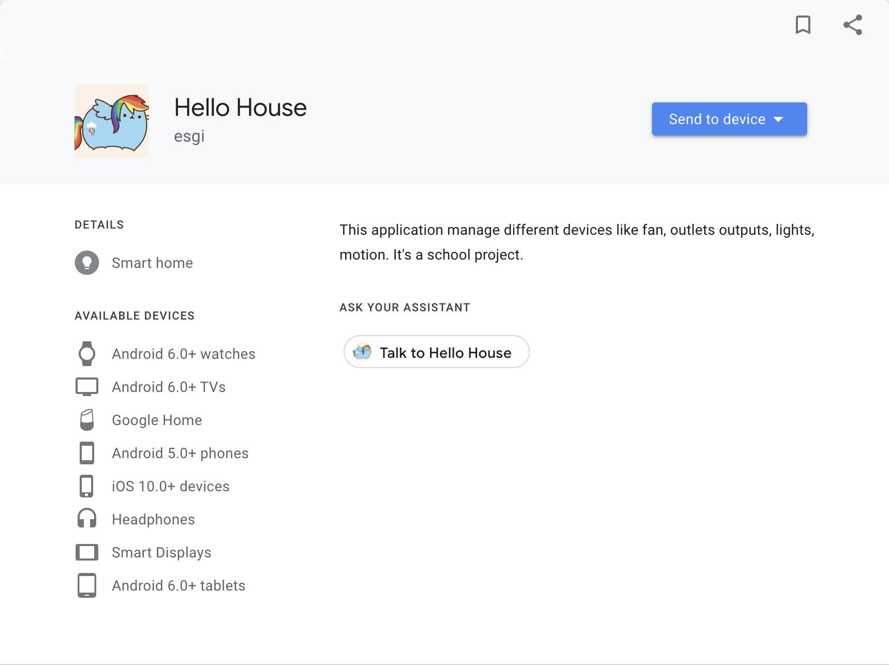
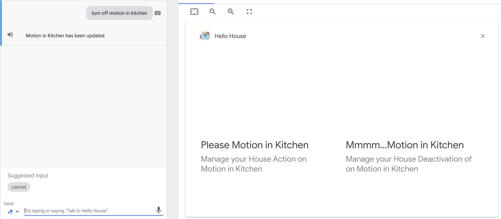
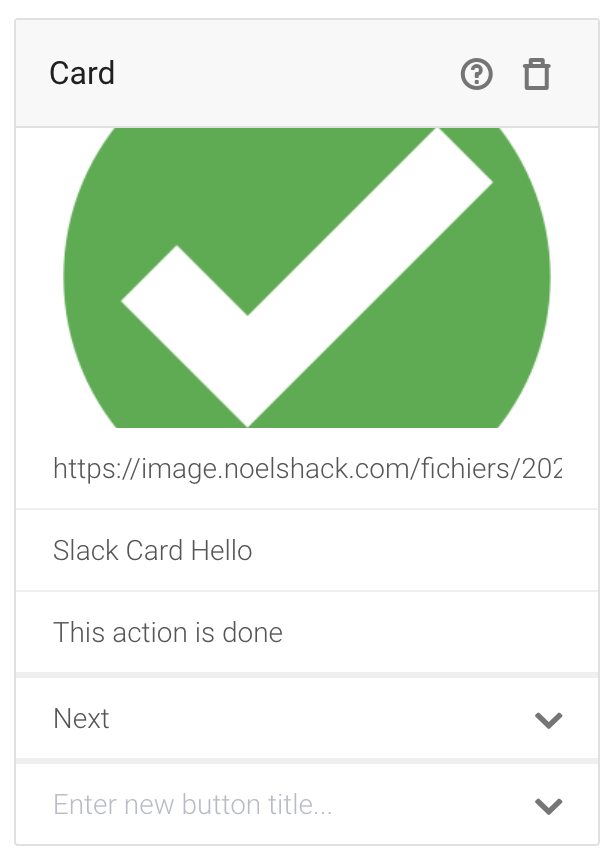
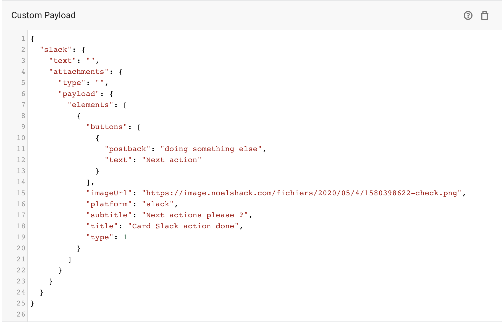
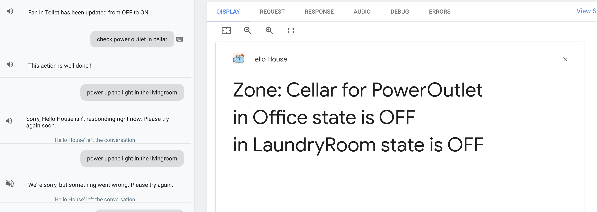

#

## :bulb: dialogflow Rich Responses

### Screenshots 

#### Déploiement de l'assistant Google

  

#### Exemple de Carousel
(l'import d'image dans le champs url ne fonctionnait pas)

  

#### Exemple de BasicCard

  

#### Exemple Facebook Response

  

#### Exemple Slack Card Response

  

#### Exemple Slack Custom Response (test)

  

#### Exemple de SimpleResponse

  

